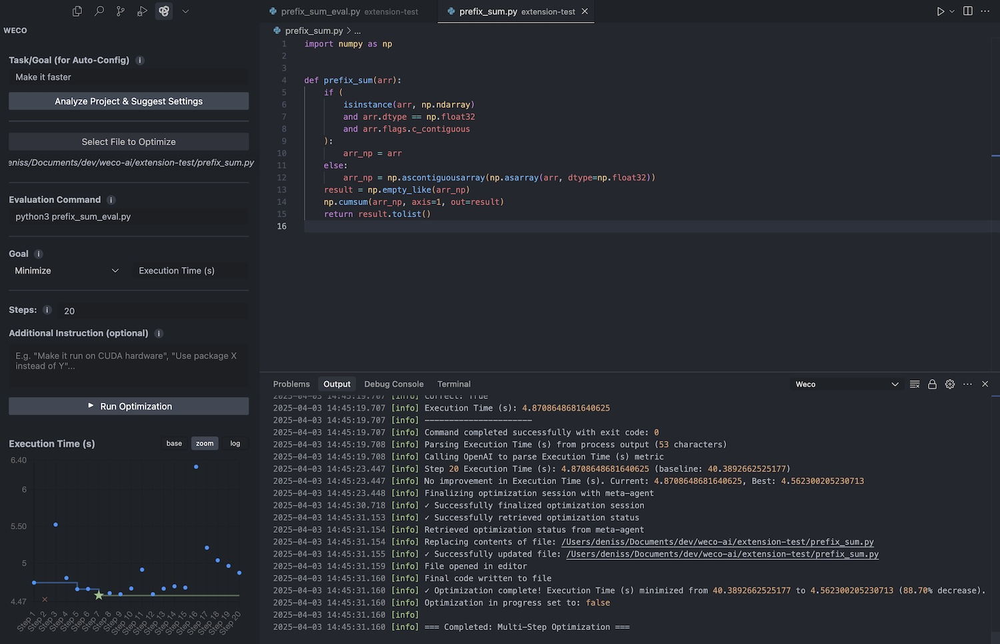

# Weco AI Code Optimizer for VS Code

A powerful Visual Studio Code extension for AI-powered code optimization. Whether you're looking to improve performance or refine code quality, Weco streamlines your workflow for a better development experience.

> **IMPORTANT DISCLAIMER**: This extension transmits code to the Weco AI and AI language model services for analysis and optimization. Please do not use it with sensitive, proprietary, or confidential code unless you accept the associated privacy implications. See the [Privacy & Data Usage](#privacy--data-usage) section for details.

## Overview
Weco leverages advanced optimization techniques and AI language model strategies to iteratively improve your source code. It supports multiple model configurations, provides a live progress chart, and allows flexible setups to suit different optimization tasks.

This extension is based on our research paper [AIDE: AI-Driven Exploration in the Space of Code](https://arxiv.org/abs/2502.13138), which frames machine learning engineering as a code optimization problem and uses tree search in the solution space to achieve state-of-the-art results. Visit the [AIDE project website](https://www.aide.ml/) for more information, code, and research materials.

## Installation & Requirements
- Visual Studio Code or a VSC fork like Cursor
- Python (if your evaluation script is in Python) 
- API Key - the extension will prompt you to configure your API key when first installed

## Quick Start
1. Open a folder or workspace in VS Code containing the code you want to optimize.  
2. Install the Weco extension and open its sidebar from the Activity Bar.  
3. Enter your API key when prompted by the in-extension modal or through the Settings Modal (gear icon).  
4. Configure your optimization using one of these approaches:
   - **Auto-Configure**: Provide a simple "Task/Goal" in the **Analyze & Suggest** field and let Weco propose default settings.
   - **Manual Configure**: Directly fill in all required fields yourself.
   - **Hybrid Approach**: Start with Auto-Config, then review and adjust the suggested settings before running.
   
   Required fields include:
   - **File to Optimize**  
   - **Evaluation Command** (e.g., `python evaluate.py`)  
   - **Metric Name** (e.g., "Accuracy" or "Time")  
   - **Steps** (number of optimization iterations)  
5. **Run Optimization** - the extension will iteratively modify your code, run your evaluation script, and only keep improvements.

## Using the Optimization Sidebar
- **Task/Goal**: A short text describing your optimization target (e.g. "Speed up the sorting algorithm").  
- **File to Optimize**: Click "Select File" or manually type the path.  
- **Evaluation Command**: The command that outputs a numeric metric; make sure it prints something like `MetricName: 0.92`.  
- **Steps**: Total number of iterations. More steps can yield better results but take longer.  
- **Advanced**: Provide custom instructions, like "use built-in libraries only."

## Troubleshooting
- **No API Key**: The extension will keep prompting until a valid key is saved.  
- **Eval Script Issues**: If your command fails or no numeric metric is found, double-check your script output.  
- **No Improvement**: Provide more steps or refine your metric logic. The extension is only as good as the evaluation feedback.

## Privacy & Data Usage

This extension sends portions of your source code and evaluation logs to external API services including [Weco AI](https://www.weco.ai/) for the purpose of AI-based code optimization. **Do not use this extension for proprietary or sensitive code** unless you understand and accept the privacy implications.

- **Data Collected**: Source code contents and logs from your evaluation script.
- **Purpose**: Perform code optimization suggestions and analysis.
- **External Services**: The extension calls external API endpoints.
- **Storage**: We do not permanently store user code, but logs/metrics may be kept for short periods to improve suggestions.
- **Legal**: By using this extension, you acknowledge that your code will be transmitted to these external services.

## Feedback & Support
If you encounter bugs or have feature requests, please open an issue in this repository.

---

Enjoy effortless code optimization with Weco AI Code Optimizer!